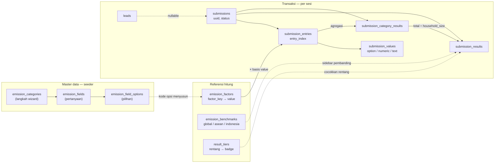

# ERD — Kalkulator Emisi Tokio Marine Green Campaign

Skema terbagi jadi tiga blok:

| Blok | Tabel | Sifat |
|---|---|---|
| **Master data** | `emission_categories`, `emission_fields`, `emission_field_options` | Konfigurasi wizard — diisi seeder, bukan user |
| **Referensi hitung & hasil** | `emission_factors`, `emission_benchmarks`, `result_tiers` | Angka faktor emisi, pembanding, dan tier badge |
| **Transaksi** | `leads`, `submissions`, `submission_entries`, `submission_values`, `submission_results`, `submission_category_results` | Data yang dihasilkan tiap sesi pengisian |

Setiap master data punya tabel `*_translations` terpisah (locale `id` / `en`) supaya ID induk tetap stabil lintas bahasa.

---

## ERD lengkap

```mermaid
erDiagram
    emission_categories ||--o{ emission_category_translations : "i18n"
    emission_categories ||--o{ emission_fields : "punya"
    emission_categories ||--o{ emission_factors : "faktor"
    emission_categories ||--o{ submission_entries : "diisi via"
    emission_categories ||--o{ submission_category_results : "rekap"

    emission_fields ||--o{ emission_field_translations : "i18n"
    emission_fields ||--o{ emission_field_options : "opsi"
    emission_fields ||--o{ submission_values : "dijawab di"
    emission_fields |o--o{ emission_fields : "depends_on (conditional)"

    emission_field_options ||--o{ emission_field_option_translations : "i18n"
    emission_field_options |o--o{ submission_values : "dipilih di"

    emission_factors |o--o{ submission_entries : "dipakai hitung"

    emission_benchmarks ||--o{ emission_benchmark_translations : "i18n"

    result_tiers ||--o{ result_tier_translations : "i18n"
    result_tiers |o--o{ submission_results : "badge"

    leads |o--o{ submissions : "opsional (diisi step akhir)"

    submissions ||--o{ submission_entries : "entri"
    submissions ||--|| submission_results : "hasil akhir"
    submissions ||--o{ submission_category_results : "rekap per kategori"

    submission_entries ||--o{ submission_values : "jawaban"

    emission_categories {
        bigint id PK
        string code UK "transportasi_darat, daya_rumah_tangga"
        string slug UK
        string calculator_key "map ke class kalkulator PHP"
        string icon
        boolean is_repeatable "Tambah Kendaraan Lain"
        smallint max_entries
        smallint sort_order
        boolean is_active
    }

    emission_category_translations {
        bigint id PK
        bigint emission_category_id FK
        string locale UK "unik bersama category_id"
        string name
        string title
        string subtitle
        string summary_label
        string add_entry_label
        text description
    }

    emission_fields {
        bigint id PK
        bigint emission_category_id FK
        string code UK "unik per kategori"
        enum input_type "single_choice, select, number, currency, text, date, multiple_choice"
        string display_style "card, dropdown, radio, stepper"
        string unit "kode kanonik: KM, Orang, Rp, VA"
        enum unit_position "prefix, suffix"
        tinyint decimals
        decimal min_value
        decimal max_value
        decimal step
        boolean is_required
        boolean is_factor_key "penyusun factor_key"
        boolean is_basis "pengali faktor"
        bigint depends_on_field_id FK "self-reference, nullable"
        string depends_on_option_code "null = cukup terisi"
        smallint sort_order
        boolean is_active
    }

    emission_field_translations {
        bigint id PK
        bigint emission_field_id FK
        string locale UK
        string label
        string placeholder
        string helper_text
        string unit_label "Orang / People"
    }

    emission_field_options {
        bigint id PK
        bigint emission_field_id FK
        string code UK "unik per field"
        string image_file
        string icon
        decimal numeric_value "900 VA, 840 watt"
        string numeric_unit
        json meta "tariff_per_kwh, renewable_share"
        smallint sort_order
        boolean is_active
    }

    emission_field_option_translations {
        bigint id PK
        bigint emission_field_option_id FK
        string locale UK
        string label
        string description
    }

    emission_factors {
        bigint id PK
        bigint emission_category_id FK
        string factor_key UK "composite: mobil-bensin, pln, atau kosong"
        decimal value "18,8 — presisi desimal kecil"
        string unit "kgCO2e/km, kgCO2e/kWh"
        string basis_unit "km, kWh, liter"
        string source
        smallint reference_year
        date valid_from
        date valid_to
        boolean is_active
        text notes
    }

    emission_benchmarks {
        bigint id PK
        string code UK "global, asean, indonesia"
        decimal value "6.26 / 7.80 / 3.62"
        string unit "tCO2e/capita/year"
        string source
        smallint reference_year
        smallint sort_order
        boolean is_active
    }

    emission_benchmark_translations {
        bigint id PK
        bigint emission_benchmark_id FK
        string locale UK
        string label "Rata-rata Global"
    }

    result_tiers {
        bigint id PK
        string code UK "champion, low, average, high"
        decimal min_ton_co2e "min <= nilai < max"
        decimal max_ton_co2e
        string badge_icon
        string color
        smallint sort_order
        boolean is_active
    }

    result_tier_translations {
        bigint id PK
        bigint result_tier_id FK
        string locale UK
        string badge_label "Champion of the Earth"
        string headline "Kamu adalah Pahlawan Hijau, :name!"
        text description
    }

    leads {
        bigint id PK
        string name
        string email "indexed"
        string whatsapp_number
        date dob
        string domicile
        string locale
    }

    submissions {
        bigint id PK
        uuid uuid UK "route key, lanjut draft tanpa login"
        bigint lead_id FK "nullable — form di step akhir"
        string locale
        enum status "draft, completed"
        timestamp completed_at
        string ip_address
        string user_agent
    }

    submission_entries {
        bigint id PK
        bigint submission_id FK
        bigint emission_category_id FK
        smallint entry_index UK "unik bertiga; 0 utk non-repeatable"
        bigint emission_factor_id FK "nullable, jejak audit"
        decimal kg_co2e_year
        json calc_meta "basis, faktor, langkah turunan"
    }

    submission_values {
        bigint id PK
        bigint submission_entry_id FK
        bigint emission_field_id FK
        bigint emission_field_option_id FK "nullable"
        decimal value_numeric
        text value_text
    }

    submission_results {
        bigint id PK
        bigint submission_id FK "UNIQUE — 1:1"
        bigint result_tier_id FK "nullable"
        smallint household_size
        decimal total_kg_co2e_year "sumber kebenaran tunggal"
        decimal per_capita_ton_co2e_year
        timestamp computed_at
    }

    submission_category_results {
        bigint id PK
        bigint submission_id FK
        bigint emission_category_id FK "unik berdua"
        decimal kg_co2e_year
        decimal percentage "porsi pie chart"
    }
```

---

## Alur data

---

## Catatan desain

**1. `factor_key` sebagai composite key.** Field ber-flag `is_factor_key` diurut berdasarkan `sort_order`, kode opsinya digabung dengan `|`. Mobil + Bensin → `mobil|bensin`. Kategori tanpa field kunci memakai `factor_key = ''` (faktor tunggal). Ini menghindari tabel pivot faktor yang bercabang-cabang.

**2. `is_basis` sebagai pengali.** Satu field per kategori ditandai `is_basis` — nilainya (km/hari, kWh/bulan) dikalikan `emission_factors.value` untuk dapat `kg_co2e_year`.

**3. `depends_on_field_id` self-reference.** Bikin field bersyarat tanpa tabel aturan terpisah: field "Bahan Bakar" hanya muncul setelah "Moda Transportasi" terisi. `depends_on_option_code` null artinya cukup terisi apa pun.

**4. Hasil dibekukan.** `submission_results` dan `submission_category_results` menyimpan angka final, plus `submission_entries.emission_factor_id` + `calc_meta` sebagai jejak audit. Halaman hasil lama tetap konsisten walau faktor emisi diperbarui.

**5. Satuan tunggal.** Semua emisi disimpan sebagai **kg CO2e per tahun**. Nilai per hari / per bulan / ton diturunkan saat render, bukan disimpan.

**6. `lead_id` nullable.** Di UI, form nama/email/WhatsApp baru muncul di langkah terakhir — jadi jawaban langkah 1–3 harus bisa tersimpan lebih dulu dalam status `draft`.

**7. Tiga nama FK dipendekkan manual** (`ecat_trans_fk`, `eopt_trans_fk`, `ebench_trans_fk`) karena nama otomatis Laravel melewati batas 64 karakter identifier MySQL.

Tabel bawaan Laravel (`users`, `cache`, `jobs`) tidak masuk ERD ini — belum ada relasi ke skema kalkulator.
